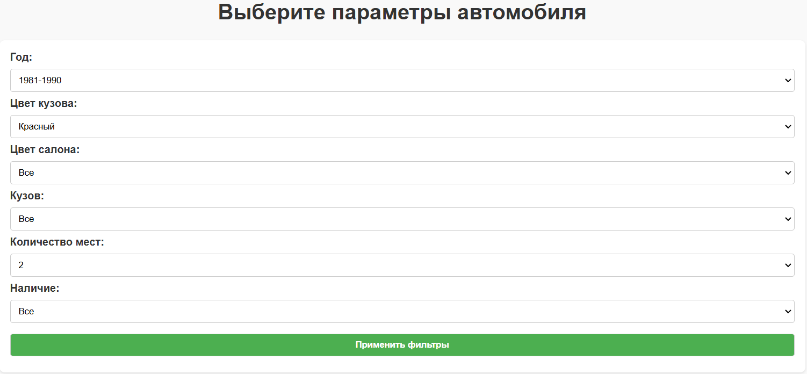
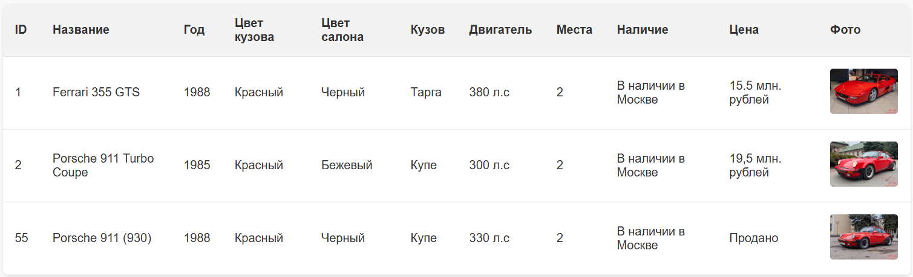

# Cars Filters

## Описание проекта
Реализован сервис по выбору раритетного автомобиля, под указанные параметры.

## Функциональность

- **Поиск автомобиля по году выпуска:** Сервис подберет автомобиль по году выпуска.
- **Поиск автомобиля по цвету кузова:** Сервис подберет автомобиль с заданным цветом кузова.
- **Поиск автомобиля по цвету салона:** Сервис подберет автомобиль с заданным цветом салона.
- **Поиск автомобиля по типу кузова:** Сервис подберет автомобиль с заданным типом кузова.
- **Поиск автомобиля по количеству мест:** Сервис подберет автомобиль по количеству мест в салоне.
- **Поиск автомобиля по наличию:** Сервис подберет автомобиль, который можно приобрести прямо сейчас в определенном городе или под заказ.
- **Скрапинг данных:** Сервис автоматически собирает данные с сайта https://antiqcar.ru/market.
- **Хранение данных:** Используется база данных SQLite, которая сохраняет автомобили между перезапусками сервиса.

## Как запустить проект

### Требования

- Git для работы с репозиторием.
- Установленный Docker и Docker Compose.
- Доступ к интернету.

### Инструкции по запуску

1. **Клонируйте репозиторий:**
```bash
git clone https://github.com/kitsgig/kits-kovyazin_review.git
cd your_project
```
2. **Запустите сервис:**
Выполните скрипт сборки и запуска:
```bash
./build.sh
```
3. **Откройте веб-приложение:** Перейдите в браузере по адресу https://localhost:5000.


4.  Вам будет доступна данная веб-страница. Вы можете использовать все доступные фильтры для подбора раритетного автомобиля. После того как вы указали все нужные фильтры, нажмите кнопку "Применить фильтры".
5. Сервис покажет подходящие автомобили.

## Как работает проект
1. **Скрапинг:** Сервис использует модуль Scrap.py для получения данных с сайта https://antiqcar.ru/market.
2. **Обработка данных:** Полученные автомобили сохраняются в базу данных SQLite.
3. **Интерфейс:** Пользователь отправляет запрос по выбранным параметрам на веб-странице, а сервис ищет подходящие автомобили в базе.

## Структура проекта

- **app.py**: Сервер Flask
- **Scrap.py**: Сбор данных с сайта
- **database.py**: Создание и работа с базой данных.
- **index.html**: HTML-шаблон для отображения сайта
- **Dockerfile** и **docker-compose.yml**: Контейнеризация приложения
- **requirements.txt**: Зависимости проекта
